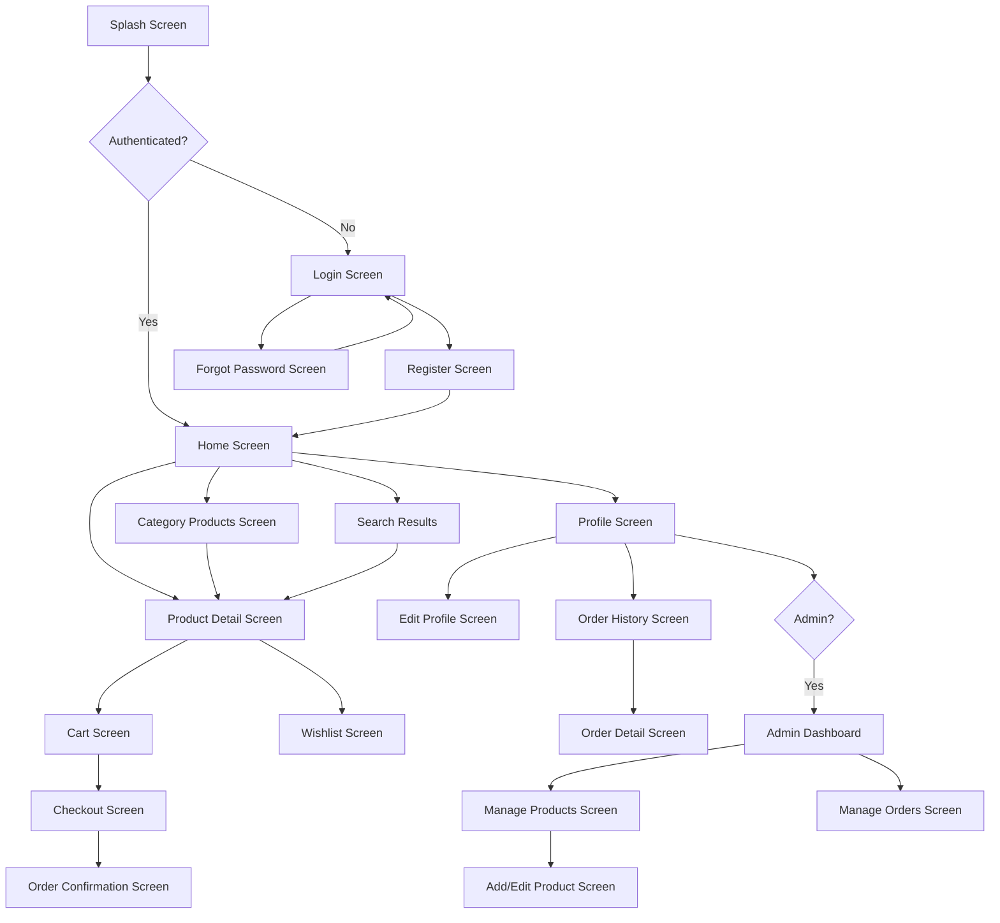

# Design Document: SmartMart E-Commerce Flutter Application

## Overview

SmartMart is a production-ready Flutter e-commerce mobile application implementing MVVM (Model-View-ViewModel) architecture with Firebase backend services. The application provides comprehensive supermarket shopping functionality including user authentication, product catalog management, shopping cart operations, order processing, and administrative capabilities.

### Architecture Philosophy

The design follows separation of concerns principles, dividing the application into distinct layers:

- **Presentation Layer (View)**: Flutter widgets and screens that render UI
- **ViewModel Layer**: Business logic and state management using Provider
- **Domain Layer**: Core business entities and use cases
- **Data Layer**: Repositories, data sources (Firebase, SQLite), and models
- **Service Layer**: Cross-cutting concerns (authentication, storage, networking)

This layered approach ensures testability, maintainability, and scalability. The repository pattern abstracts data sources, allowing seamless switching between local (SQLite) and remote (Firestore) storage. Provider-based state management provides reactive UI updates with minimal boilerplate.

### Key Design Decisions

1. **MVVM over MVC/BLoC**: MVVM provides clear separation between UI and business logic while maintaining simplicity. ViewModels expose streams and notifiers that widgets observe, enabling reactive programming without the complexity of BLoC's event-state pattern.

2. **Repository Pattern**: Centralizes data access logic, providing a single source of truth. Repositories handle caching, offline synchronization, and data source coordination.

3. **Provider for State Management**: Chosen for its simplicity, official Flutter team support, and seamless integration with MVVM. Provider handles dependency injection and state propagation efficiently.

4. **Hybrid Storage Strategy**: SQLite for offline-first cart operations (fast, synchronous access) and Firestore for synchronized data (products, orders, user profiles). This ensures app functionality during network unavailability.

5. **Material 3 Design System**: Implements modern UI patterns with dynamic theming, ensuring consistency and accessibility across light and dark modes.


### Category Model

```dart
class CategoryModel {
  final String categoryId;
  final String name;
  final String? imageUrl;
  final int displayOrder;
  
  factory CategoryModel.fromFirestore(DocumentSnapshot doc);
  Map<String, dynamic> toFirestore();
}
```

### Cart Item Model

```dart
class CartItemModel {
  final String productId;
  final String productName;
  final double price;
  final String imageUrl;
  final int quantity;
  final DateTime addedAt;
  
  double get subtotal => price * quantity;
  
  factory CartItemModel.fromMap(Map<String, dynamic> map);
  Map<String, dynamic> toMap();
  factory CartItemModel.fromFirestore(Map<String, dynamic> data);
  Map<String, dynamic> toFirestore();
}
```

### Order Model

```dart
class OrderModel {
  final String orderId;
  final String userId;
  final List<OrderItem> items;
  final double subtotal;
  final double tax;
  final double totalAmount;
  final DeliveryAddress deliveryAddress;
  final OrderStatus status;
  final PaymentMethod paymentMethod;
  final DateTime createdAt;
  final DateTime? updatedAt;
  
  factory OrderModel.fromFirestore(DocumentSnapshot doc);
  Map<String, dynamic> toFirestore();
}

class OrderItem {
  final String productId;
  final String productName;
  final double price;
  final int quantity;
  final String imageUrl;
  
  double get subtotal => price * quantity;
}

class DeliveryAddress {
  final String street;
  final String city;
  final String state;
  final String zipCode;
  final String? additionalInfo;
}

enum OrderStatus { pending, processing, shipped, delivered, cancelled }
enum PaymentMethod { cashOnDelivery, card, mobileMoney }
```

### Wishlist Model

```dart
class WishlistModel {
  final String userId;
  final List<String> productIds;
  final DateTime updatedAt;
  
  factory WishlistModel.fromFirestore(DocumentSnapshot doc);
  Map<String, dynamic> toFirestore();
}
```

## Database Schema

### Firestore Collections

#### users Collection

```
users/{userId}
  - userId: string
  - name: string
  - email: string
  - phone: string?
  - profileImageUrl: string?
  - role: string (enum: "customer", "admin")
  - createdAt: timestamp
  
Indexes:
  - email (ascending)
  - role (ascending)
```

#### products Collection

```
products/{productId}
  - productId: string
  - name: string
  - description: string
  - price: number
  - categoryId: string
  - imageUrls: array<string>
  - stock: number
  - isAvailable: boolean
  - createdAt: timestamp
  - updatedAt: timestamp
  
Indexes:
  - categoryId (ascending), createdAt (descending)
  - name (ascending)
  - isAvailable (ascending), createdAt (descending)
```


#### categories Collection

```
categories/{categoryId}
  - categoryId: string
  - name: string
  - imageUrl: string?
  - displayOrder: number
  
Indexes:
  - displayOrder (ascending)
```

#### carts Collection

```
carts/{userId}
  - userId: string
  - items: array<map>
    - productId: string
    - productName: string
    - price: number
    - imageUrl: string
    - quantity: number
    - addedAt: timestamp
  - updatedAt: timestamp
  
Indexes:
  - userId (ascending)
```

#### orders Collection

```
orders/{orderId}
  - orderId: string
  - userId: string
  - items: array<map>
    - productId: string
    - productName: string
    - price: number
    - quantity: number
    - imageUrl: string
  - subtotal: number
  - tax: number
  - totalAmount: number
  - deliveryAddress: map
    - street: string
    - city: string
    - state: string
    - zipCode: string
    - additionalInfo: string?
  - status: string (enum: "pending", "processing", "shipped", "delivered", "cancelled")
  - paymentMethod: string
  - createdAt: timestamp
  - updatedAt: timestamp?
  
Indexes:
  - userId (ascending), createdAt (descending)
  - status (ascending), createdAt (descending)
```

#### wishlist Collection

```
wishlist/{userId}
  - userId: string
  - productIds: array<string>
  - updatedAt: timestamp
  
Indexes:
  - userId (ascending)
```

### SQLite Schema (Local Database)

```sql
-- Cart Items Table
CREATE TABLE cart_items (
  id INTEGER PRIMARY KEY AUTOINCREMENT,
  product_id TEXT NOT NULL,
  product_name TEXT NOT NULL,
  price REAL NOT NULL,
  image_url TEXT NOT NULL,
  quantity INTEGER NOT NULL,
  added_at INTEGER NOT NULL,
  UNIQUE(product_id)
);

-- User Preferences Table
CREATE TABLE user_preferences (
  key TEXT PRIMARY KEY,
  value TEXT NOT NULL
);
```

## Navigation Flow

### Route Structure

```dart
// Route definitions using GoRouter
final appRouter = GoRouter(
  initialLocation: '/splash',
  routes: [
    GoRoute(
      path: '/splash',
      builder: (context, state) => SplashScreen(),
    ),
    GoRoute(
      path: '/login',
      builder: (context, state) => LoginScreen(),
    ),
    GoRoute(
      path: '/register',
      builder: (context, state) => RegisterScreen(),
    ),
    GoRoute(
      path: '/forgot-password',
      builder: (context, state) => ForgotPasswordScreen(),
    ),
    ShellRoute(
      builder: (context, state, child) => MainLayout(child: child),
      routes: [
        GoRoute(
          path: '/home',
          builder: (context, state) => HomeScreen(),
        ),
        GoRoute(
          path: '/categories',
          builder: (context, state) => CategoryListScreen(),
          routes: [
            GoRoute(
              path: ':categoryId',
              builder: (context, state) => CategoryProductsScreen(
                categoryId: state.params['categoryId']!,
              ),
            ),
          ],
        ),
        GoRoute(
          path: '/product/:productId',
          builder: (context, state) => ProductDetailScreen(
            productId: state.params['productId']!,
          ),
        ),
        GoRoute(
          path: '/cart',
          builder: (context, state) => CartScreen(),
        ),
        GoRoute(
          path: '/wishlist',
          builder: (context, state) => WishlistScreen(),
        ),
        GoRoute(
          path: '/profile',
          builder: (context, state) => ProfileScreen(),
        ),
      ],
    ),
    GoRoute(
      path: '/checkout',
      builder: (context, state) => CheckoutScreen(),
    ),
    GoRoute(
      path: '/order-confirmation/:orderId',
      builder: (context, state) => OrderConfirmationScreen(
        orderId: state.params['orderId']!,
      ),
    ),
    GoRoute(
      path: '/orders',
      builder: (context, state) => OrderHistoryScreen(),
      routes: [
        GoRoute(
          path: ':orderId',
          builder: (context, state) => OrderDetailScreen(
            orderId: state.params['orderId']!,
          ),
        ),
      ],
    ),
    GoRoute(
      path: '/admin',
      builder: (context, state) => AdminDashboardScreen(),
      routes: [
        GoRoute(
          path: 'products',
          builder: (context, state) => ManageProductsScreen(),
        ),
        GoRoute(
          path: 'products/add',
          builder: (context, state) => AddEditProductScreen(),
        ),
        GoRoute(
          path: 'products/edit/:productId',
          builder: (context, state) => AddEditProductScreen(
            productId: state.params['productId'],
          ),
        ),
        GoRoute(
          path: 'orders',
          builder: (context, state) => ManageOrdersScreen(),
        ),
      ],
    ),
  ],
);
```


### Navigation Flow Diagram



### Bottom Navigation Structure

```dart
enum BottomNavItem {
  home(icon: Icons.home, label: 'Home', route: '/home'),
  categories(icon: Icons.category, label: 'Categories', route: '/categories'),
  cart(icon: Icons.shopping_cart, label: 'Cart', route: '/cart'),
  wishlist(icon: Icons.favorite, label: 'Wishlist', route: '/wishlist'),
  profile(icon: Icons.person, label: 'Profile', route: '/profile');
  
  final IconData icon;
  final String label;
  final String route;
}
```

## Provider Setup

### Provider Initialization

```dart
// main.dart
void main() async {
  WidgetsFlutterBinding.ensureInitialized();
  await Firebase.initializeApp(options: DefaultFirebaseOptions.currentPlatform);
  
  final sharedPreferences = await SharedPreferences.getInstance();
  
  runApp(
    MultiProvider(
      providers: [
        // Data Sources
        Provider<FirebaseAuth>(create: (_) => FirebaseAuth.instance),
        Provider<FirebaseFirestore>(create: (_) => FirebaseFirestore.instance),
        Provider<FirebaseStorage>(create: (_) => FirebaseStorage.instance),
        Provider<SharedPreferences>(create: (_) => sharedPreferences),
        
        // Repositories
        ProxyProvider<FirebaseAuth, AuthRepository>(
          update: (_, auth, __) => AuthRepository(
            FirebaseAuthDataSource(auth),
          ),
        ),
        ProxyProvider<FirebaseFirestore, ProductRepository>(
          update: (_, firestore, __) => ProductRepository(
            FirestoreDataSource(firestore),
          ),
        ),
        ProxyProvider2<FirebaseFirestore, SharedPreferences, CartRepository>(
          update: (_, firestore, prefs, __) => CartRepository(
            SQLiteDataSource(),
            FirestoreDataSource(firestore),
          ),
        ),
        ProxyProvider<FirebaseFirestore, OrderRepository>(
          update: (_, firestore, __) => OrderRepository(
            FirestoreDataSource(firestore),
          ),
        ),
        ProxyProvider<FirebaseFirestore, WishlistRepository>(
          update: (_, firestore, __) => WishlistRepository(
            FirestoreDataSource(firestore),
          ),
        ),
        
        // Providers
        ChangeNotifierProxyProvider<AuthRepository, AuthProvider>(
          create: (context) => AuthProvider(
            context.read<AuthRepository>(),
          ),
          update: (_, repo, provider) => provider ?? AuthProvider(repo),
        ),
        ChangeNotifierProxyProvider<ProductRepository, ProductProvider>(
          create: (context) => ProductProvider(
            context.read<ProductRepository>(),
          ),
          update: (_, repo, provider) => provider ?? ProductProvider(repo),
        ),
        ChangeNotifierProxyProvider2<CartRepository, AuthProvider, CartProvider>(
          create: (context) => CartProvider(
            context.read<CartRepository>(),
            context.read<AuthProvider>(),
          ),
          update: (_, repo, auth, provider) => 
            provider ?? CartProvider(repo, auth),
        ),
        ChangeNotifierProxyProvider2<OrderRepository, AuthProvider, OrderProvider>(
          create: (context) => OrderProvider(
            context.read<OrderRepository>(),
            context.read<AuthProvider>(),
          ),
          update: (_, repo, auth, provider) => 
            provider ?? OrderProvider(repo, auth),
        ),
        ChangeNotifierProxyProvider2<WishlistRepository, AuthProvider, WishlistProvider>(
          create: (context) => WishlistProvider(
            context.read<WishlistRepository>(),
            context.read<AuthProvider>(),
          ),
          update: (_, repo, auth, provider) => 
            provider ?? WishlistProvider(repo, auth),
        ),
        ChangeNotifierProvider<ThemeProvider>(
          create: (context) => ThemeProvider(
            context.read<SharedPreferences>(),
          ),
        ),
        ChangeNotifierProxyProvider3<ProductRepository, OrderRepository, AuthProvider, AdminProvider>(
          create: (context) => AdminProvider(
            context.read<ProductRepository>(),
            context.read<OrderRepository>(),
            context.read<AuthProvider>(),
          ),
          update: (_, productRepo, orderRepo, auth, provider) => 
            provider ?? AdminProvider(productRepo, orderRepo, auth),
        ),
      ],
      child: const SmartMartApp(),
    ),
  );
}
```

